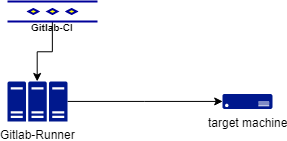

# Continue Integration


## Gitlab-CI

### How to configure gitlab-ci custom runner to remote machine

In embedded system development, most system are not able execute Gitlab-Runner, but we still hope leverage the gitlab runners. If so, you can use [custom runner](https://docs.gitlab.com/runner/executors/custom.html) to configure yours. Here is an example to exec your test in remote machine, the topology like below



The target machine should support mount and ssh, then the work follow are

1. startup custom executor configure
2. mount Gitlab-Runner's build directory to target machine via ssh
3. executor custom build_script via ssh

you can find example in 

--


```bash
sudo apt-get update
sudo apt-get install nfs-kernel-server
```

edit /etc/exports

```bash
# /etc/exports: the access control list for filesystems which may be exported
#		to NFS clients.  See exports(5).
#
# Example for NFSv2 and NFSv3:
# /srv/homes       hostname1(rw,sync,no_subtree_check) hostname2(ro,sync,no_subtree_check)
#
# Example for NFSv4:
# /srv/nfs4        gss/krb5i(rw,sync,fsid=0,crossmnt,no_subtree_check)
# /srv/nfs4/homes  gss/krb5i(rw,sync,no_subtree_check)
#
/tmp/_ci *(rw,sync,no_subtree_check)
```


```bash
sudo exportfs -a
sudo service nfs-kernel-server start
```


test if this worked in remote

```
mkdir /tmp/_ci
mount -t nfs -o nolock 172.16.192.169:/tmp/_ci /tmp/_ci
ls /tmp/_ci -l

```

