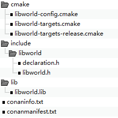

# Getting Started

Let's get started with an example:  ***Hello*** app which reads string from library ***libworld*** and output to console.

As the ***Hello*** depend on ***libworld*** library, so first we should create library, then ***Hello*** executable program.

In this chapter we demonstrate `VS2019` building, you can simply replace `vs2019` with `gcc5` to build Linux program. 

## Library of libworld

### Initialize library project

Initialize epm package project

create a folder and initialize project in it.

```bash
$ mkdir libworld
$ cd libworld
$ epm init lib
lib package <libworld> project created successfully.
Please check README.md for details

```

 Command `init`   with subcommand `lib` create a project of  C/C++ library.

With the command executing successfully you will find some files under the folder, we will discuss more details later, now let move on.

Add C/C++ API for library

epm  initialized a source file `source/libworld.c` for the project

the original libworld.c

```c
#include <libhello/libhello.h>
LIBWORLD_CAPI const char* libhello_version()
{
    return "0.0.1";
}
```

let's add a function `world` for **Hello** application.

```c
#include <libhello/libhello.h>

LIBWORLD_CAPI const char* libhello_version()
{
    return "0.0.1";
}

LIBWORLD_CAPI const char* world()
{
    return "World";
}
```

and declare it  in  `include/libworld/libworld.h`

```c
#ifndef _LIBHELLO_LIBRARY_HEADER_H_
#define _LIBHELLO_LIBRARY_HEADER_H_

#include "declaration.h"

LIBWORLD_CAPI const char* libhello_version();

LIBWORLD_CAPI const char* world();
#endif /* !_LIBHELLO_LIBRARY_HEADER_H_ */
```


We will shortly introduce the package.yml - package meta-information manifest 

The package.yml is YAML format files,  

```yaml
name: libworld
version: 0.0.1
description: libworld is lib ....
configuration:
  profile:
  - vs2019
  - gcc5
  scheme:
    dynamic:
      shared: true
sandbox:
  test_package: test_package/libworld_test

script:
  gitlab-ci: script/gitlab-ci.py


```

* `confiuration`

  * `profile`  parts show you what's kind of Compiler can used to do build.

    `vs2019` - Microsoft Visual Studio 2019

    `gcc5` - GNU GCC5

    All the profiles could be found in  ~/.epm/profiles (%USERPROFILE%.epm/profiles) installed profile.

  * `scheme` defined value of build options

    In this example `dynamic` scheme will build dynamic lib windows

    Actually, there is 'default' scheme. It is not showed here, because all the options same as `default_options` in conanfile.py 

    The configuration is used for `build`,  `create`, `sandbox`. for example,

    ```shell
    epm -c vs2019 build
    ```

    this mean build a Windows static library with Microsoft Visual Studio 2019, actually the full configuration name is `vs2019@default`, default scheme has been motted.

    ```c
    epm -c gcc5@dynamic build
    ```

    this will build an Linux shared lib with GNU gcc5

### Build library project

Similar to GNU autocooks, fully build process composed *configure*, *make*, *install* 

let's look through the `build` command help

```sh
usage: epm build [-h] [--runner RUNNER] [-c] [-p] [-i] [-t]

optional arguments:
  -c, --configure     Execute the configuration step. When specified,
                      package/install/test_package won't run unless
                      --package/--install/--test specified
  -p, --package       Execute the package build step. When specified,
                      configure/install/test_package won't run unless
                      --configure/--install/--test specified
  -i, --install       Execute the install step (variable should_install=True).
                      When When specified, configure/package/test_package
                      won't run unless --configure/--package/--test_package
                      specified
  -t, --test_package  Execute the test step (variable should_test=True). When
                      When specified, configure/package/install won't run
                      unless --configure/--package/--install specified

```


#### configure

in configure step, the epm will install dependencies components,

```shell
epm -c vs2019 build --configure
```

```shell
[configure ......]
Configuration:
[settings]
arch=x86_64
arch_build=x86_64
build_type=Release
compiler=Visual Studio
compiler.runtime=MD
compiler.version=16
os=Windows
os_build=Windows
[options]
[build_requires]
[env]
conanfile.py (libworld/0.0.1@examples/dev): Installing package
Requirements
Packages
conanfile.py (libworld/0.0.1@examples/dev): Generator cmake created conanbuildinfo.cmake
conanfile.py (libworld/0.0.1@examples/dev): Generator txt created conanbuildinfo.txt
conanfile.py (libworld/0.0.1@examples/dev): Generated conaninfo.txt
conanfile.py (libworld/0.0.1@examples/dev): Generated graphinfo
conanfile.py (libworld/0.0.1): Configuring sources in C:\examples\libworld
```

With above output, you can figure out what's the configuration is. and you can see the epm has install conanbuildinfo.cmake, coanbuildinfo.txt with conan .

#### build package

now let's build the library package.

```
epm -c vs2019 build --package
```

```txt
[build ......]
conanfile.py (libworld/0.0.1@examples/dev): Running build()
-- Selecting Windows SDK version 10.0.17763.0 to target Windows 10.0.18362.
-- The C compiler identification is MSVC 19.23.28106.4
-- The CXX compiler identification is MSVC 19.23.28106.4
-- Check for working C compiler: C:/Program Files (x86)/Microsoft Visual Studio/2019/Community/VC/Tools/MSVC/14.23.28105/bin/Hostx64/x64/cl.exe
-- Check for working C compiler: C:/Program Files (x86)/Microsoft Visual Studio/2019/Community/VC/Tools/MSVC/14.23.28105/bin/Hostx64/x64/cl.exe -- works
-- Detecting C compiler ABI info
-- Detecting C compiler ABI info - done
-- Detecting C compile features
-- Detecting C compile features - done
-- Check for working CXX compiler: C:/Program Files (x86)/Microsoft Visual Studio/2019/Community/VC/Tools/MSVC/14.23.28105/bin/Hostx64/x64/cl.exe
-- Check for working CXX compiler: C:/Program Files (x86)/Microsoft Visual Studio/2019/Community/VC/Tools/MSVC/14.23.28105/bin/Hostx64/x64/cl.exe -- works
-- Detecting CXX compiler ABI info
-- Detecting CXX compiler ABI info - done
-- Detecting CXX compile features
-- Detecting CXX compile features - done
-- Conan: called by CMake conan helper
-- Conan: Adjusting output directories
-- Conan: Using cmake global configuration
-- Conan: Adjusting default RPATHs Conan policies
-- Conan: Adjusting language standard
-- Configuring done
-- Generating done
  Checking Build System
  CMake does not need to re-run because C:/examples/libworld/.epm/vs2019/build/CMakeFiles/generate.stamp is up-to-date.
  CMake does not need to re-run because C:/examples/libworld/.epm/vs2019/build/cmake/CMakeFiles/generate.stamp is up-to-date.
  Building Custom Rule C:/examples/libworld/cmake/CMakeLists.txt
  CMake does not need to re-run because C:/examples/libworld/.epm/vs2019/build/cmake/CMakeFiles/generate.stamp is up-to-date.
  libworld.c
  libworld.vcxproj -> C:\examples\libworld\.epm\vs2019\build\lib\libworld.lib
  Building Custom Rule C:/examples/libworld/CMakeLists.txt
  CMake does not need to re-run because C:/examples/libworld/.epm/vs2019/build/CMakeFiles/generate.stamp is up-to-date.
```

From above logs you can get the process doing configure with CMake, building with VS2019.

now we got the library ` C:\examples\libworld\.epm\vs2019\build\lib\libworld.lib`


#### Install package

Previous step built libraries, now let install the package

```shell
epm -c vs2019 build --install
```

```
[install ......]
Using lockfile: 'C:\examples\libworld\.epm\vs2019\build/conan.lock'
Using cached profile from lockfile
conanfile.py (libworld/0.0.1@examples/dev): Generating the package
conanfile.py (libworld/0.0.1@examples/dev): Package folder C:\examples\libworld\.epm\vs2019\package
conanfile.py (libworld/0.0.1@examples/dev): Calling package()
-- Selecting Windows SDK version 10.0.17763.0 to target Windows 10.0.18362.
-- Conan: called by CMake conan helper
-- Conan: Adjusting output directories
-- Conan: Using cmake global configuration
-- Conan: Adjusting default RPATHs Conan policies
-- Conan: Adjusting language standard
-- Configuring done
-- Generating done
-- Build files have been written to: C:/examples/libworld/.epm/vs2019/build
  Checking Build System
  CMake does not need to re-run because C:/examples/libworld/.epm/vs2019/build/CMakeFiles/generate.stamp is up-to-date.
  CMake does not need to re-run because C:/examples/libworld/.epm/vs2019/build/cmake/CMakeFiles/generate.stamp is up-to-date.
  Building Custom Rule C:/examples/libworld/cmake/CMakeLists.txt
  CMake does not need to re-run because C:/examples/libworld/.epm/vs2019/build/cmake/CMakeFiles/generate.stamp is up-to-date.
  libworld.vcxproj -> C:\examples\libworld\.epm\vs2019\build\lib\libworld.lib
  Building Custom Rule C:/examples/libworld/CMakeLists.txt
  CMake does not need to re-run because C:/examples/libworld/.epm/vs2019/build/CMakeFiles/generate.stamp is up-to-date.
  -- Install configuration: "Release"
  -- Installing: C:/examples/libworld/.epm/vs2019/package/cmake/libworld-targets.cmake
  -- Installing: C:/examples/libworld/.epm/vs2019/package/cmake/libworld-targets-release.cmake
  -- Up-to-date: C:/examples/libworld/.epm/vs2019/package/cmake
  -- Installing: C:/examples/libworld/.epm/vs2019/package/cmake/libworld-config.cmake
  -- Installing: C:/examples/libworld/.epm/vs2019/package/include
  -- Installing: C:/examples/libworld/.epm/vs2019/package/include/libworld
  -- Installing: C:/examples/libworld/.epm/vs2019/package/include/libworld/declaration.h
  -- Installing: C:/examples/libworld/.epm/vs2019/package/include/libworld/libworld.h
  -- Installing: C:/examples/libworld/.epm/vs2019/package/lib/libworld.lib
conanfile.py (libworld/0.0.1@examples/dev) package(): Packaged 3 '.cmake' files: libworld-config.cmake, libworld-targets-release.cmake, libworld-targets.cmake
conanfile.py (libworld/0.0.1@examples/dev) package(): Packaged 2 '.h' files: declaration.h, libworld.h
conanfile.py (libworld/0.0.1@examples/dev) package(): Packaged 1 '.lib' file: libworld.lib
conanfile.py (libworld/0.0.1@examples/dev): Package 'package' created
conanfile.py (libworld/0.0.1@examples/dev): Created package revision f59cc7a20c16864a21c4a77aa2eca151
```

The installation destination is `.epm/vs2019/package`, then we got the directory tree



#### Test package

Now we have built the library, but we do not know if it works, so we should write some test code. There is test_package folder in the project, epm has generate test skeleton with Google GTest. Let do coding for the test (test_package/src/test.cpp)

```c++
#include<gtest/gtest.h>
#include <libworld/libworld.h>
class Libworld :public testing::Test
{
public:
    virtual void SetUp(){}
    virtual void TearDown() {}
};
TEST_F(Libworld, version)
{
	ASSERT_STREQ("0.0.1", libworld_version());
}

// add test case for world API
TEST_F(Libworld, world)
{
	ASSERT_STREQ("World", world());
}
```

Let's build the test program

```shell
epm -c vs2019 build --test_package
```

```txt
[package testing  ......]
Using layout file: C:\examples\libworld\.epm\vs2019\conan.layout
Configuration:
[settings]
arch=x86_64
arch_build=x86_64
build_type=Release
compiler=Visual Studio
compiler.runtime=MD
compiler.version=16
os=Windows
os_build=Windows
[options]
[build_requires]
[env]

libworld/0.0.1@examples/dev (test package): Installing package
Requirements
    gtest/1.8.1@epm-oss/dev from 'epm-oss' - Cache
    libworld/0.0.1@examples/dev from user folder - Editable
Packages
    gtest/1.8.1@epm-oss/dev:5ad274d83035c78ba2b205e6cf4f1b317aee8e05 - Cache
    libworld/0.0.1@examples/dev:3fb49604f9c2f729b85ba3115852006824e72cab - Editable

gtest/1.8.1@epm-oss/dev: Already installed!
   ......................................................
      CMake configure and VS2019 buildiing logs ....... 
   ......................................................
C:\examples\libworld\test_package\src\main.cpp C:\examples\libworld\test_package\src\test.cpp
  main.cpp
  test.cpp
  libworld_test.vcxproj -> C:\examples\libworld\.epm\vs2019\test_package\bin\libworld_test.exe
  Building Custom Rule C:/examples/libworld/test_package/CMakeLists.txt
  CMake does not need to re-run because C:/examples/libworld/.epm/vs2019/test_package/CMakeFiles/generate.stamp is up-to-date.
libworld/0.0.1@examples/dev (test package): Running test()
```

You can see the epm automatically find its dependencies `gtest` and `libworld` and built test program 

`.epm\vs2019\test_package\bin\libworld_test.exe`

now let's run the test program with sandbox

```shell
epm -c vs2019 sandbox test_package
```

```shell
[==========] Running 2 tests from 1 test case.
[----------] Global test environment set-up.
[----------] 2 tests from Libworld
[ RUN      ] Libworld.version
[       OK ] Libworld.version (0 ms)
[ RUN      ] Libworld.world
[       OK ] Libworld.world (0 ms)
[----------] 2 tests from Libworld (1 ms total)

[----------] Global test environment tear-down
[==========] 2 tests from 1 test case ran. (1 ms total)
[  PASSED  ] 2 tests.
```

The test is passed.


### Cache package

Previous steps show how to build package, but if you have other package wants to use it you have to cache it into your local storage. command `create` is the one you need build package and install it into local cache, so that other project can find it.

```shell
epm -c vs2019 create
```

```txt
Exporting package recipe
Configuration:
[settings]
arch=x86_64
arch_build=x86_64
build_type=Release
compiler=Visual Studio
compiler.runtime=MD
compiler.version=16
os=Windows
os_build=Windows
[options]
[build_requires]
[env]

libworld/0.0.1@examples/dev: Forced build from source
libworld/0.0.1@examples/dev (test package): Installing package
Requirements
    gtest/1.8.1@epm-oss/dev from 'epm-oss' - Cache
    libworld/0.0.1@examples/dev from local cache - Cache
Packages
    gtest/1.8.1@epm-oss/dev:5ad274d83035c78ba2b205e6cf4f1b317aee8e05 - Cache
    libworld/0.0.1@examples/dev:3fb49604f9c2f729b85ba3115852006824e72cab - Build

  -- Installing: C:/Users/mingyi/.conan/data/libworld/0.0.1/examples/dev/package/3fb49604f9c2f729b85ba3115852006824e72cab/cmake/libworld-targets.cmake
  -- Installing: C:/Users/mingyi/.conan/data/libworld/0.0.1/examples/dev/package/3fb49604f9c2f729b85ba3115852006824e72cab/cmake/libworld-targets-release.cmake
  -- Up-to-date: C:/Users/mingyi/.conan/data/libworld/0.0.1/examples/dev/package/3fb49604f9c2f729b85ba3115852006824e72cab/cmake
  -- Installing: C:/Users/mingyi/.conan/data/libworld/0.0.1/examples/dev/package/3fb49604f9c2f729b85ba3115852006824e72cab/cmake/libworld-config.cmake
  -- Installing: C:/Users/mingyi/.conan/data/libworld/0.0.1/examples/dev/package/3fb49604f9c2f729b85ba3115852006824e72cab/include
  -- Installing: C:/Users/mingyi/.conan/data/libworld/0.0.1/examples/dev/package/3fb49604f9c2f729b85ba3115852006824e72cab/include/libworld
  -- Installing: C:/Users/mingyi/.conan/data/libworld/0.0.1/examples/dev/package/3fb49604f9c2f729b85ba3115852006824e72cab/include/libworld/declaration.h
  -- Installing: C:/Users/mingyi/.conan/data/libworld/0.0.1/examples/dev/package/3fb49604f9c2f729b85ba3115852006824e72cab/include/libworld/libworld.h
  -- Installing: C:/Users/mingyi/.conan/data/libworld/0.0.1/examples/dev/package/3fb49604f9c2f729b85ba3115852006824e72cab/lib/libworld.lib
libworld/0.0.1@examples/dev package(): Packaged 3 '.cmake' files: libworld-config.cmake, libworld-targets-release.cmake, libworld-targets.cmake
libworld/0.0.1@examples/dev package(): Packaged 2 '.h' files: declaration.h, libworld.h
libworld/0.0.1@examples/dev package(): Packaged 1 '.lib' file: libworld.lib
libworld/0.0.1@examples/dev: Package '3fb49604f9c2f729b85ba3115852006824e72cab' created
libworld/0.0.1@examples/dev: Created package revision e80ec36e48687b113fd99e60f76adea6
libworld/0.0.1@examples/dev (test package): Generator cmake created conanbuildinfo.cmake
libworld/0.0.1@examples/dev (test package): Generator txt created conanbuildinfo.txt
libworld/0.0.1@examples/dev (test package): Generated conaninfo.txt
libworld/0.0.1@examples/dev (test package): Generated graphinfo
```

The create command do all the build command action and install (copy) package to local cache

you can use conan command to check  the package infomation 

```shell
$ conan inspect libworld/0.0.1@examples/dev
```

```yaml
name: libworld
version: 0.0.1
url: https://HOME.com/libworld
homepage: https://HOME.com/libworld
license: MIT
author: Unknown
description: libworld is lib ....
topics: ('conan', 'libworld')
generators: cmake
exports: ['package.yml']
exports_sources: ['CMakeLists.txt', 'test_pacakge/*', 'include/*', 'source/*', 'cmake/*']
short_paths: False
apply_env: True
build_policy: None
revision_mode: hash
settings: ('os', 'arch', 'compiler', 'build_type')
options:
    fPIC: [True, False]
    shared: [True, False]
default_options:
    fPIC: True
    shared: False
```


## Application of Hello

### Initialize application project

```shell
$ mkdir hello
$ cd hello
$ epm init app
app package <hello> project created successfully.
Please check README.md for details
```


### Build application project

The build command usage is same as library, be before we build, we need do some coding

1. add library requirement

   add `dependencies` part in package.yml as below

   ```yaml
   dependencies:
     libworld:
       version: 0.0.1
   ```

   

2. coding sources

   `source/main.c`

   ```c
   #include <stdio.h>
   #include <libworld/libworld.h> /* add declaration for libworld require*/
   int main( int argc, char** argv )
   {
       // output to console
       printf("Hello %s.", world());
       return 0;
   }
   ```

   

   

3. build package

   ```shell
   epm -c vs2019 build
   ```

4. Test package

   For application package, epm generated test framework not `GTest` but `Python Unittest `. Check for test_package, you will find main.py and test_hello.py, those are Python test source file.

   Let's change assert for previous changes.

   ```python
   import unittest
   from epm.api import API
   
   
   class Testhello(unittest.TestCase):
   
       def test_hello(self):
           sandbox = API().sandbox()
           proc = sandbox.excutor('hello')
           proc.run()
   
           self.assertEqual(0, proc.returncode)
           # self.assertEqual('hello 0.0.1', proc.stdout().strip())
   	    self.assertEqual('Hello World', proc.stdout().strip())
   ```

   now let first run the hello application in sandbox directly

   ```shell
   $ epm -c vs2019 sandbox hello
   Hello World.
   ```

   

   run with python test 

   ***NOTE*** the command is **run** 

   ```shell
   $ epm -c vs2019 run test
   C:\examples\hello>epm -c vs2019 run test
   F
   ======================================================================
   FAIL: test_hello (test_hello.Testhello)
   ----------------------------------------------------------------------
   Traceback (most recent call last):
     File "C:\examples\hello\test_package\test_hello.py", line 14, in test_hello
       self.assertEqual('Hello World', proc.stdout().strip())
   AssertionError: 'Hello World' != 'Hello World.'
   - Hello World
   + Hello World.
   ?            +
   ```

   Why failed?  check the source you will get it. Add the dot in test_hello.py assertion. then run again.

   ```shell
   $ epm -c vs2019 run test
   .
   ----------------------------------------------------------------------
   Ran 1 test in 0.039s
   
   OK
   ```

   