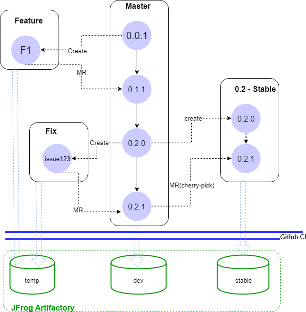

 <h1>Gitlab Flow at EPM </h1>  
 
# Introduction

This chapter discusses how to apply gitlab flow in epm project. If you are not familiar with gitlab-flow please refer to [official docs](https://docs.gitlab.com/ee/university/training/gitlab_flow.html). epm use the [Feature branches (include fix branch)](https://docs.gitlab.com/ce/university/training/gitlab_flow.html#feature-branches)  and [Release branches](https://docs.gitlab.com/ce/university/training/gitlab_flow.html#release-branch) as gitlab advised.

A simple work follow as below:

1. Initiative project as version 0.0.1
2. Create feature branch `F1` for feature development.
3. Feature complete, then MR(merge request) to master with 0.1.1
4. Integration and Validation on the master commit (0.1.1), 
5. Plan and create branch for release 0.2, 
6. Some issue (bug) reported,  create issue in Gitlab and take the latest bumped version as core version and issue number as `build` version to fix this issue, that is `0.1.0` + `issue123`
7. If the release 0.2.0 need a hot-fix, we should do [cherry-pick](https://mirrors.edge.kernel.org/pub/software/scm/git/docs/git-cherry-pick.html) to fix this issue in 0.2 branch as a hot fix
8. `feature` and `fix` branches as temporary would be deleted at any time later.

Behind the Git, There are C/C++ package repositories (on conan server [JFrog Artifactory](https://jfrog.com/open-source/)). We use conan to manipulate package. CMO may configure a virtual repository to include all the project required repositories, so that you do not have to care too much  as a developer.   Upload action happens on CI process,  and therefore CMO is responsible for the configuration work.

In case, developer wants to upload package and shares with others, we propose to setup a isolated conan repository to avoid destructiveness of whole project by misoperation .

# Versioning

We conform [Semantic Versioning 2.0.0](https://semver.org/) rule, fix and feature version will be present on `build` field 

We can reference GNU/Gnome [Stable and Unstable Package Versions](https://developer.gnome.org/programming-guidelines/stable/versioning.html.en#stable-unstable-versions) plan, that is, all unstable in master branch, stable in release branches. temporary branch version with issue or feature name.

# Artifactory Repo

You should setup three standalone repository for dev, testing and stable, whatever by machine or only conan repository. and configure different [Gitlab-Runner](https://docs.gitlab.com/runner/) in Gitlab CI to ensue each package/project upload to right remote repository in CI jobs.

