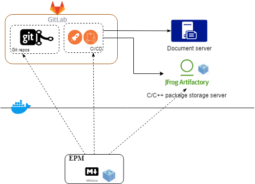

  **Embedded-system package manager base on [conan](conan.io) and [docker](https://docker.io).**

------

EPM is an embedded-system package manager base on [Conan](https://conan.io/) and [Docker](https://docker.com/), intended for C/C++ development team, and it extends many utilities to manage build, test, document and continuous integration to improve team development efficiency and quality.

EPM , is inspired by [npm](npmjs.org) ([Node.JS](nodejs.org) package manager),  uses meta-information manifest ( package.yml) to manipulate development activities of the package.

EPM can be use to :

* create project skeleton.
* all conan features (building, cache, publish package ...)
* run built program in sandbox no need to set dependent dynamic libraries paths
*  a command to generate CI configure file to avoid complicated configure.
* collaborate with Gitlab (via .gitlab-ci.yml) to easy continuous integration
* manage versioning document of Markdown by underlying [MKdocs](https://www.mkdocs.org/) .

EPM is born for continuous integration, thus it well collaborates with CI/CD system. following is a typical deployment. 

