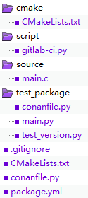
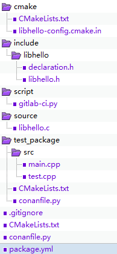

# EPM Project

EPM Project is a set of files to fulfill building and continue integration job. for example you can create a simple hello world with following command.

```shell
epm new app --name HelloWorld
```

```bash
epm new lib --name libhello
```


Above command help you created C/C++ executable program of  and library . directory tree as below

| HelloWorld                           | libhello                           |
| ------------------------------------ | ---------------------------------- |
|  |  |

We will explain the each file functionality, first let have a look the `init` command and it's arguments.

| command arguments | comments                                                     |      |
| ----------------- | ------------------------------------------------------------ | ---- |
| --name            | The name of the package.                                     |      |
| --version         | version of the package, if not set `0.0.1` will be filled by epm |      |
| --type            | lib or app (executable program) project to be generated      |      |


# package.yml

The package.yml is very import file, you will configure the project and package meta information with this one. for more details please check in epm package metadata manifest.


The Hello generated package.yml as below

```yaml
name: HelloWorld 
version: 0.0.1
user: epm-public

license: MIT
description: HelloWorld is app ....

configuration:
  profile:
  - vs2019
  - gcc5
  scheme:
    dynamic:
      shared: true
sandbox:
  HelloWorld: package/bin/HelloWorld

script:
  gitlab-ci: python script/gitlab-ci.py
  test: test_package/main.py ${configuration}
#
#dependencies:
#  dep-lib-name:
#    version: version_this_module_dep
#    user: user_of_the_dep_module
```

license and description are work as their indication, no usage for your program.

The `user` field comes from conan system, which is part of conan reference. You can simply take it as group or a repository. If you use a remote package storage server, it will be corresponding to a URL to upload your built package.

 Conan reference format is name/version@user/channel, the name and version are used to describe package's name and version. But user may have a lit confuse,  the channel is used for the different objective build, for example, stable or dev like chrome can be gotten from different channel (stable or dev), channel is not explicated set in epm, it is retrieved from environment vars EPM_CHANNEL, EPM_CHANNEL not set in environment dev will be taken as default.


`configuration` has two part profile and scheme, profile is corresponding to conan profile, and scheme is mnemonic name of conan options. with these two part we can 